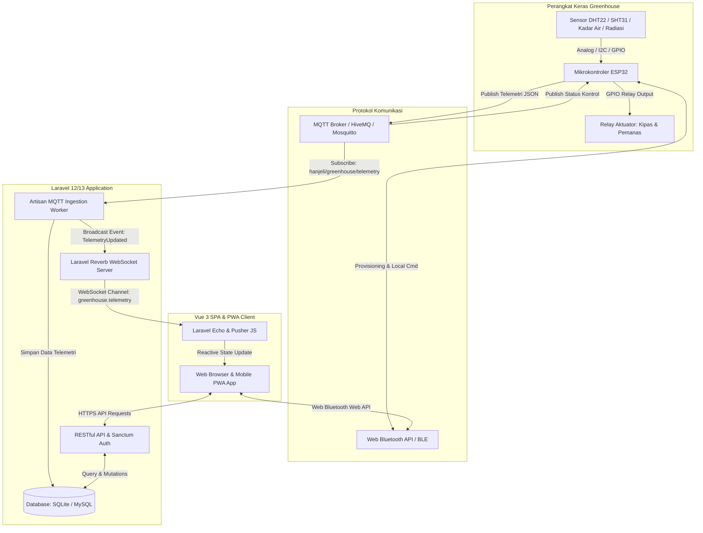

# 🌾 Smart Room Dryer Hanjeli — IoT Greenhouse Monitoring & Control System

<p align="center">
  
  &nbsp;&nbsp;&nbsp;&nbsp;
  
</p>

<p align="center">
  <strong>Sistem Cerdas Otomasi dan Pemantauan Pengeringan Biji Hanjeli Berbasis IoT, WebSockets Real-Time, dan Web Bluetooth (BLE)</strong><br>
  <em>Dikembangkan oleh <a href="https://github.com/fatintsani"><strong>@fatin_tsani</strong></a> dari <strong>CoE STAS-RG</strong> untuk Pengabdian Masyarakat di Desa Wisata Hanjeli Waluran, Sukabumi</em>
</p>

<p align="center">
  
  
  
  
  
  
  
  
</p>

---

## 📋 Daftar Isi

1. [Tentang Sistem](#-tentang-sistem)
2. [Arsitektur & Alur Data](#-arsitektur--alur-data)
3. [Tech Stack & Teknologi](#-tech-stack--teknologi)
4. [Fitur-Fitur Utama](#-fitur-fitur-utama)
5. [Struktur Proyek](#-struktur-proyek)
6. [Panduan Instalasi & Setup](#-panduan-instalasi--setup)
7. [Menjalankan Layanan (Multi-Service)](#-menjalankan-layanan-multi-service)
8. [Akun Default & Hak Akses](#-akun-default--hak-akses)
9. [Dokumentasi API & Integrasi Hardware](#-dokumentasi-api--integrasi-hardware)
10. [Konfigurasi ESP32 & MQTT Topics](#-konfigurasi-esp32--mqtt-topics)
11. [Design System & UI/UX](#-design-system--uiux)
12. [Lisensi & Kredit](#-lisensi--kredit)

---

## 🌾 Tentang Sistem

**Smart Room Dryer Hanjeli** adalah platform *Agro-Industrial IoT* terintegrasi yang dirancang untuk mengoptimalkan, memonitor, dan mengotomasi proses pengeringan pascapanen biji hanjeli (*Coix lacryma-jobi*) di dalam fasilitas *Greenhouse*.

Sistem ini memecahkan tantangan pengeringan tradisional yang sangat rentan terhadap cuaca buruk, kelembaban berlebih, dan risiko pertumbuhan jamur dengan memanfaatkan:
- **Pengendalian Iklim Mikro**: Sensor suhu & kelembaban (internal & eksternal), radiasi matahari, dan sensor kadar air biji hanjeli.
- **Aktuasi Otomatis & Manual**: Kendali kipas exhaust udara lembap, kipas intake udara segar, kipas sirkulasi internal, dan elemen pemanas cadangan (*auxiliary heater*).
- **Telemetri Real-Time**: Distribusi data instan sub-detik melalui protokol MQTT dan WebSockets (*Laravel Reverb*).
- **Dual-Mode IoT Provisioning**: Konfigurasi jaringan dan kalibrasi sensor langsung di lokasi melalui *Web Bluetooth API (BLE)* dan WiFi.

---

## 🏗 Arsitektur & Alur Data

Sistem menggunakan arsitektur *Event-Driven IoT Pipeline*:



---

## 🛠 Tech Stack & Teknologi

### 1. Backend (Server & Real-Time Engine)
| Teknologi | Versi / Keterangan | Fungsi |
| :--- | :--- | :--- |
| **PHP** | `^8.3` | Bahasa pemrograman backend utama |
| **Laravel Framework** | `12.x / 13.x` | Framework MVC, routing, Eloquent ORM, migrasi, dan seeders |
| **Laravel Reverb** | `^1.11` | High-performance WebSocket server bawaan Laravel untuk broadcast real-time |
| **Laravel Sanctum** | `^4.3` | Autentikasi API berbasis token aman (SPA & Mobile) |
| **php-mqtt/client** | `^2.3` | MQTT Client library untuk worker daemon penangkap payload ESP32 |
| **Socialite & Passkeys** | WebAuthn / Biometric | Login dengan Google & Passkey Biometrik (Fingerprint/FaceID) |

### 2. Frontend (Single Page Application & PWA)
| Teknologi | Versi / Keterangan | Fungsi |
| :--- | :--- | :--- |
| **Vue.js** | `^3.5` (Composition API) | Framework frontend reaktif dengan `<script setup>` |
| **Vite** | `^6.0 / ^8.0` | Frontend build tool super cepat dan Hot Module Replacement (HMR) |
| **Vue Router** | `^4.x` | Client-side routing dengan sistem proteksi *Role-Based Navigation Guards* |
| **Tailwind CSS** | `^4.0` | Utility-first CSS framework untuk styling responsif modern |
| **Laravel Echo + Pusher JS** | `Echo ^2.4` / `Pusher ^8.6` | Client WebSocket subscriber ke server Reverb |
| **Motion (Framer Motion)** | `^13.2` | Animasi dan transisi antarmuka fluid |
| **Lucide Icons & FontAwesome**| `^1.41` | Ikonografi vektor SVG presisi tinggi |
| **i18n (Internationalization)**| Custom Reactive Store | Dukungan multi-bahasa instan (Bahasa Indonesia & English) |
| **Web Bluetooth API** | Native Browser API | Pairing dan konfigurasi ESP32 secara nirkabel via BLE |

### 3. Hardware & IoT Firmware
| Komponen | Spesifikasi / Model | Peran |
| :--- | :--- | :--- |
| **Mikrokontroler** | ESP32-WROOM-32 (Dual Core 240MHz, WiFi & BLE) | Otak pemrosesan sensor dan transmisi data |
| **Sensor Suhu & RH Internal** | DHT22 / SHT31 | Mengukur suhu (°C) dan kelembaban udara ruang dryer (%) |
| **Sensor Lingkungan Luar** | DHT22 / Solar Pyranometer / LDR | Suhu luar, kelembaban ambient, dan radiasi sinar matahari |
| **Sensor Kadar Air Hanjeli** | Capacitive / Resistance Grain Moisture Probe | Menghitung persentase kadar air biji hanjeli |
| **Aktuator** | 4-Channel Relay 5V/12V | Mengendalikan Exhaust Fan, Intake Fan, Circulation Fan, Heater |

---

## ✨ Fitur-Fitur Utama

### 📊 1. Real-Time Telemetry & Monitoring Dashboard
- **Metrik Sensor Lengkap**: Pembacaan suhu internal/eksternal, kelembaban udara ruang dryer, kelembaban lingkungan, intensitas radiasi matahari ($W/m^2$), dan kadar air biji hanjeli ($14\%$ standar simpan).
- **Status Konektivitas IoT**: Indikator status koneksi MQTT, WebSocket Reverb, dan HTTP Polling fallback.
- **Grafik Tren Interaktif**: Visualisasi time-series suhu, kelembaban, dan kadar air untuk mendeteksi anomali pengeringan.

### ⚙️ 2. Aktuator & Kontrol Iklim Mikro (Manual & Otomatis)
- **Exhaust Fan**: Membuang udara panas lembap dari atap greenhouse.
- **Intake Fan**: Memasukkan udara segar dari luar saat kondisi cuaca cerah dan kering.
- **Circulation Fan**: Meratakan distribusi suhu panas di seluruh rak pengering biji.
- **Auxiliary Heater**: Pemanas cadangan otomatis aktif saat malam hari atau cuaca mendung/hujan.
- **Mode Kontrol**: Pilihan antara mode **Otomatis (Sesuai Ambang Batas Parameter)** atau **Manual (Override Operator)**.

### 🌾 3. Manajemen Batch Pengeringan
- Pencatatan sesi batch pengeringan baru (Nama varietas hanjeli, berat awal kg, target kadar air, estimasi waktu).
- Aksi kendali batch: **Mulai (Start)**, **Jeda (Pause)**, **Lanjutkan (Resume)**, dan **Selesai (Complete)**.
- Riwayat pengeringan komprehensif beserta kalkulasi efisiensi dan susut bobot.
- Ekspor laporan batch pengeringan ke format CSV, Excel, dan PDF.

### 📲 4. Web Bluetooth (BLE) Device Provisioning
- Hubungkan browser ke ESP32 tanpa kabel USB menggunakan **Web Bluetooth API**.
- Konfigurasi SSID & Password WiFi greenhouse langsung dari smartphone/laptop.
- Kalibrasi nilai offset sensor suhu dan kelembaban secara langsung di lapangan.

### 🧪 5. Hardware Simulator & Digital Twin
- Tersedia simulator firmware internal dan web interface untuk menguji seluruh logika pengeringan tanpa harus terhubung ke fisik ESP32.
- Mengirimkan payload acak atau simulasi skenario ekstrem (hujan lebat, panas terik, suhu kritis).

### 🔐 6. Sistem Autentikasi Modern & Multi-Level Role
- **Multi-Role**: Hak akses terpisah untuk `ADMIN` (pengaturan parameter, manajemen user, log sistem) dan `OPERATOR` / `PETANI` (operasional batch, monitoring, kontrol aktuator).
- **Metode Login**:
  - Email & Password standar
  - Google OAuth One-Click Login
  - Passkeys / Biometric (WebAuthn Fingerprint & FaceID)
  - Fitur Reset Password dengan 6-Digit OTP via Email HTML Template
- **Zero-Shadow Industrial Theme**: Tampilan UI presisi tinggi dengan garis border tegas, bebas efek bayangan, adaptif untuk tema Terang (Light) dan Gelap (Dark).

---

## 📁 Struktur Proyek

```
app-smart-dryer-hanjeli/
├── app/
│   ├── Console/Commands/
│   │   └── GreenhouseMqttWorker.php    # Worker daemon penangkap data MQTT ESP32
│   ├── Events/
│   │   ├── ActuatorUpdated.php         # Event broadcast WebSocket status aktuator
│   │   ├── CriticalAlertTriggered.php  # Event peringatan bahaya/anomali
│   │   └── TelemetryUpdated.php        # Event broadcast WebSocket data telemetri
│   ├── Http/Controllers/Api/
│   │   ├── ActuatorController.php      # API kontrol relay aktuator
│   │   ├── AlertController.php         # API sistem notifikasi peringatan
│   │   ├── AuthController.php          # API login, register, OTP, passkeys
│   │   ├── BatchController.php         # API batch pengeringan & ekspor
│   │   ├── DashboardController.php     # API statistik ringkasan
│   │   ├── DeviceController.php        # API manajemen perangkat IoT
│   │   ├── SettingController.php       # API konfigurasi parameter target
│   │   ├── TelemetryController.php     # API ingest & riwayat telemetri
│   │   └── UserController.php          # API manajemen pengguna (Admin)
│   ├── Models/                         # Eloquent Models (Batch, Telemetry, Device, Setting, Alert)
│   └── Services/                       # MqttService, PasskeyService, TelemetryService
├── database/
│   ├── migrations/                     # Skema tabel database sistem
│   └── seeders/                        # Data awal akun admin/operator & batch demo
├── docs/
│   ├── DESIGN.md                       # Standarisasi Zero-Shadow UI/UX Design System
│   ├── esp32_smart_dryer_dual_mode/    # Firmware ESP32 lengkap (WiFi, MQTT, BLE)
│   └── esp32_smart_dryer_simulator/   # Firmware simulator ESP32
├── resources/
│   ├── css/
│   │   ├── app.css                     # Tailwind CSS v4 entry point
│   │   └── style.css                   # Custom global Zero-Shadow styling & variables
│   ├── js/
│   │   ├── components/                 # Komponen UI Vue (Header, Sidebar, Modals, Toasts)
│   │   ├── i18n/                       # Modul multibahasa (id.js & en.js)
│   │   ├── router/index.js             # Routing Vue & Route Guards
│   │   ├── services/                   # Service API, WebSocket, MQTT, BLE, Theme, Auth
│   │   ├── views/
│   │   │   ├── admin/                  # Halaman Admin (Overview, Devices, Users, Params)
│   │   │   ├── auth/                   # Halaman Login, Register, Forgot Password
│   │   │   ├── operator/               # Halaman Monitoring, Active Drying, History, Guide
│   │   │   └── public/LandingView.vue  # Halaman Utama (Landing Page)
│   │   ├── App.vue                     # Root Component
│   │   └── app.js                      # Inisialisasi Vue & Plugin
│   └── views/                          # Blade templates (app.blade.php, Email layouts)
├── routes/
│   ├── api.php                         # Definisi rute RESTful API (/api/...)
│   ├── channels.php                    # Definisi otorisasi channel WebSocket Reverb
│   └── web.php                         # Single Page Application entry route
├── .env.example                        # Contoh konfigurasi variabel lingkungan
├── package.json                        # Dependensi NodeJS frontend
└── composer.json                       # Dependensi PHP backend
```

---

## 🚀 Panduan Instalasi & Setup

### Prasyarat Sistem
Pastikan perangkat Anda telah terpasang:
- **PHP** `>= 8.3` dengan ekstensi (`pdo`, `pdo_sqlite` / `pdo_mysql`, `mbstring`, `openssl`, `curl`)
- **Composer** `>= 2.7`
- **Node.js** `>= 18.x` dan **NPM** `>= 9.x`
- **Git**

---

### Langkah 1: Clone Repository
```bash
git clone https://github.com/fatintsani/app-smart-dryer-hanjeli.git
cd app-smart-dryer-hanjeli
```

### Langkah 2: Install Dependensi PHP & Node.js
```bash
# Install package backend
composer install

# Install package frontend
npm install
```

### Langkah 3: Konfigurasi File Lingkungan (.env)
Salin `.env.example` menjadi `.env`:
```bash
cp .env.example .env
```

Buka `.env` dan periksa parameter penting:
```env
APP_NAME="Smart Dryer Hanjeli"
APP_URL=http://localhost:8000

# Database (Default menggunakan SQLite)
DB_CONNECTION=sqlite

# WebSocket Broadcasting (Laravel Reverb)
BROADCAST_CONNECTION=reverb
REVERB_APP_ID=hanjeli_app_id
REVERB_APP_KEY=hanjeli_reverb_key
REVERB_APP_SECRET=hanjeli_reverb_secret
REVERB_HOST="localhost"
REVERB_PORT=8080
REVERB_SCHEME=http

VITE_REVERB_APP_KEY="${REVERB_APP_KEY}"
VITE_REVERB_HOST="${REVERB_HOST}"
VITE_REVERB_PORT="${REVERB_PORT}"
VITE_REVERB_SCHEME="${REVERB_SCHEME}"

# MQTT Broker (Untuk ESP32 Hardware)
MQTT_HOST=broker.hivemq.com
MQTT_PORT=1883
MQTT_TOPIC_TELEMETRY=hanjeli/greenhouse/telemetry
MQTT_TOPIC_ACTUATORS=hanjeli/greenhouse/actuators
MQTT_TOPIC_COMMAND=hanjeli/greenhouse/command
```

### Langkah 4: Generate Application Key & Database Setup
```bash
# Buat file database SQLite jika belum ada
touch database/database.sqlite

# Generate Application Encryption Key
php artisan key:generate

# Jalankan migrasi tabel dan masukkan data awal (seeder)
php artisan migrate --seed
```

---

## ⚡ Menjalankan Layanan (Multi-Service)

Untuk menjalankan ekosistem Smart Room Dryer Hanjeli secara penuh, Anda membutuhkan **4 proses layanan** berjalan di latar belakang:

```
┌────────────────────────────────────────────────────────────────────────────┐
│                    EKOSISTEM SMART DRYER HANJELI                           │
├──────────────────────────┬──────────────────────────┬──────────────────────┤
│ 1. Laravel Web Server    │ php artisan serve        │ Port: 8000           │
│ 2. Vite Frontend Server  │ npm run dev              │ Port: 5173           │
│ 3. WebSocket Reverb      │ php artisan reverb:start │ Port: 8080           │
│ 4. MQTT Ingestion Daemon │ php artisan greenhouse:  │ Broker: HiveMQ 1883  │
│                          │ mqtt-worker              │                      │
└──────────────────────────┴──────────────────────────┴──────────────────────┘
```

### Opsi A: Menjalankan Sekaligus (Rekomendasi)
Buka 3-4 jendela terminal:

**Terminal 1 — Web Server & Asset Compiler:**
```bash
npm run start
# Menjalankan concurrently "php artisan serve" dan "vite"
```

**Terminal 2 — WebSocket Server (Reverb):**
```bash
php artisan reverb:start
```

**Terminal 3 — MQTT Ingestion Worker (ESP32 Listener):**
```bash
php artisan greenhouse:mqtt-worker
```

Setelah semua berjalan, buka browser dan akses: **`http://localhost:8000`**

---

## 👥 Akun Default & Hak Akses

Setelah menjalankan `php artisan migrate --seed`, akun berikut siap digunakan:

| Role | Email | Password | Hak Akses |
| :--- | :--- | :--- | :--- |
| **Administrator** | `admin@hanjeli.id` | `admin123` | Akses penuh: manajemen perangkat, manajemen pengguna, log audit, ubah batas suhu/kelembaban |
| **Operator** | `operator@hanjeli.id` | `operator123` | Monitoring real-time, kontrol aktuator (kipas/pemanas), mulai & selesaikan batch pengeringan |
| **Petani (Demo)** | `petani@hanjeli.id` | `petani123` | Pemantauan progres kadar air biji hanjeli, melihat riwayat sesi |

---

## 📡 Dokumentasi API & Integrasi Hardware

### 1. Ringkasan Endpoint RESTful API

#### Autentikasi
- `POST /api/auth/login` : Login user & penerbitan token Sanctum.
- `POST /api/auth/register` : Registrasi akun operator baru.
- `POST /api/auth/google` : Autentikasi Google Sign-In.
- `POST /api/auth/forgot-password` : Mengirimkan kode OTP 6-digit ke email.
- `POST /api/auth/verify-otp` : Validasi token OTP.
- `POST /api/auth/reset-password` : Pembaruan password akun.
- `POST /api/auth/passkey/*` : Registrasi dan verifikasi Passkey WebAuthn.

#### Telemetri & Aktuator
- `GET /api/telemetry/current` : Mengambil data pembacaan sensor terbaru.
- `GET /api/telemetry/history` : Mengambil data riwayat telemetri time-series.
- `POST /api/telemetry/ingest` : Endpoint HTTP Ingestion data sensor dari ESP32 (alternatif MQTT).
- `GET /api/actuators/status` : Mengambil status aktuator saat ini.
- `PATCH /api/actuators/control` : Mengubah status saklar relai/kecepatan kipas secara manual.

#### Batch Pengeringan
- `GET /api/batches/active` : Memeriksa sesi pengeringan yang sedang aktif berjalan.
- `POST /api/batches` : Membuat sesi batch pengeringan baru.
- `PATCH /api/batches/{id}/pause` : Menjeda proses pengeringan.
- `PATCH /api/batches/{id}/resume` : Melanjutkan pengeringan.
- `PATCH /api/batches/{id}/complete` : Menyelesaikan batch & menghasilkan rekap data.
- `GET /api/batches/{id}/export` : Mengunduh laporan hasil pengeringan.

---

## 🔌 Konfigurasi ESP32 & MQTT Topics

### Format Payload Telemetri (ESP32 -> Server)
Topic: `hanjeli/greenhouse/telemetry`
```json
{
  "deviceId": "ESP32-HANJELI-01",
  "tempInternal": 48.5,
  "humidityInternal": 42.0,
  "tempExternal": 31.2,
  "humidityExternal": 75.0,
  "solarRadiation": 680,
  "grainMoisture": 16.8,
  "exhaustFan": true,
  "intakeFan": false,
  "circFan": true,
  "auxHeater": false,
  "batteryLevel": 98
}
```

### Format Payload Kontrol Aktuator (Server -> ESP32)
Topic: `hanjeli/greenhouse/command` atau `hanjeli/greenhouse/actuators`
```json
{
  "target": "EXHAUST_FAN",
  "state": true,
  "speed": 100,
  "mode": "MANUAL",
  "timestamp": 1725792000
}
```

---

## 🎨 Design System & UI/UX

Aplikasi mengadopsi standar **Zero-Shadow Industrial Design System**:
1. **Zero Shadow**: Tidak menggunakan properti `box-shadow` atau `drop-shadow`. Seluruh hirarki visual diperjelas oleh garis batas (*crisp 1px border stroke*) dan *tonal surface contrast*.
2. **Agricultural Color Identity**:
   - **Primary Green**: `#0D631B` (Representasi kesuburan dan pertanian hanjeli).
   - **Thermal Orange**: `#EA580C` (Indikator suhu dan pemanas).
   - **Moisture Blue**: `#0284C7` (Indikator kelembaban udara).
   - **Harvest Amber**: `#D97706` (Indikator kadar air biji hanjeli).
3. **PWA & Mobile First**: Dilengkapi navigasi bawah (*Bottom Navigation Bar*), panel kontrol sentuh presisi, dan *install prompt* untuk kemudahan petani di lapangan.

---

## 📄 Lisensi & Kredit

Proyek ini dikembangkan dalam rangka kegiatan Pengabdian kepada Masyarakat (Abdimas) Program Pengeringan Biji Hanjeli Greenhouse:
- **Pengembang / Lead Developer**: [**@fatintsani**](https://github.com/fatintsani) (@fatin_tsani)
- **Pusat Riset**: **Center of Excellence STAS-RG** (*Smart Technology & Automated Systems Research Group*)
- **Mitra Lapangan**: **Desa Wisata Hanjeli**, Waluran, Geopark Ciletuh-Palabuhanratu, Sukabumi, Jawa Barat
- **Lisensi**: [MIT License](LICENSE). Bebas digunakan dan dikembangkan untuk kemajuan teknologi pertanian Indonesia.

<p align="center">
  Dibuat dengan ❤️ oleh <strong><a href="https://github.com/fatintsani">@fatin_tsani</a></strong> (CoE STAS-RG) untuk kemajuan Petani Hanjeli Indonesia 🌾
</p>

