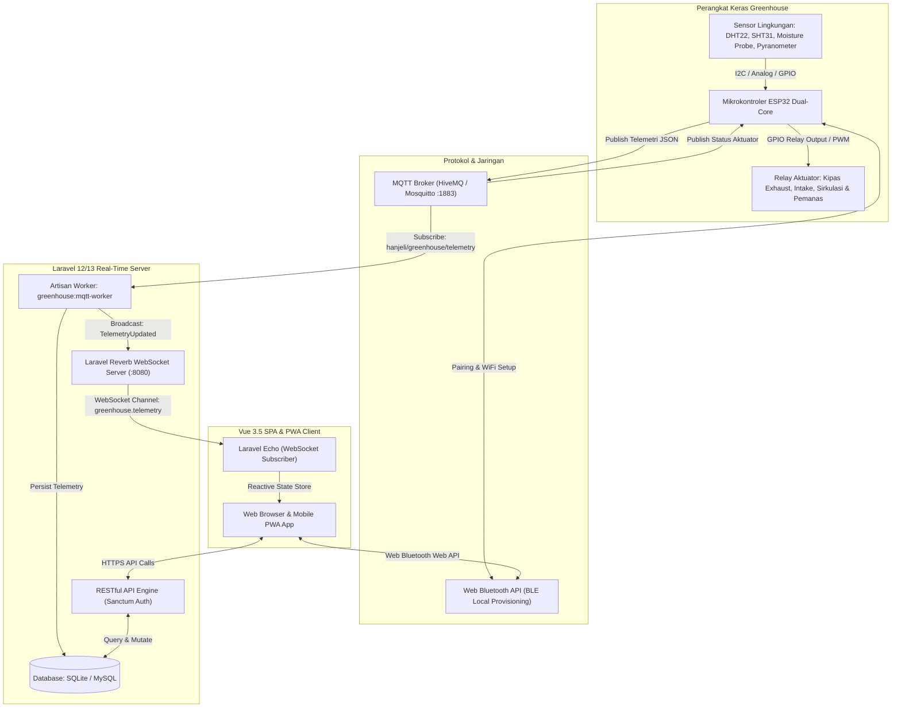

# 🌾 Smart Room Dryer Hanjeli — IoT Greenhouse Monitoring & Control System

<p align="center">
  
  &nbsp;&nbsp;&nbsp;&nbsp;&nbsp;&nbsp;&nbsp;&nbsp;
  
</p>

<p align="center">
  <strong>Sistem Cerdas Otomasi dan Pemantauan Pengeringan Biji Hanjeli Berbasis Agro-Industrial IoT, WebSockets Real-Time, dan Web Bluetooth (BLE)</strong><br>
  <em>Dikembangkan oleh <a href="https://github.com/fatintsani"><strong>@fatin_tsani</strong></a> dari <strong>CoE STAS-RG</strong> untuk Program Pengabdian kepada Masyarakat di Desa Wisata Hanjeli (Jl. Pamoyan, Waluran Mandiri, Kec. Waluran, Kabupaten Sukabumi, Jawa Barat 43175, Indonesia)</em>
</p>

<p align="center">
  <a href="https://github.com/fatintsani/app-smart-dryer-hanjeli/releases/tag/v1.0.0">
    
  </a>
  
  
</p>

<p align="center">
  
  
  
  
  
  
  
  
</p>

---

## 📋 Daftar Isi

1. [Tentang Sistem & Latar Belakang](#-tentang-sistem--latar-belakang)
2. [Sorotan Fitur Versi 1.0 (v1.0.0 Release)](#-sorotan-fitur-versi-10-v100-release)
3. [Arsitektur & Alur Data Sistem](#-arsitektur--alur-data-sistem)
4. [Tech Stack & Spesifikasi Teknologi](#-tech-stack--spesifikasi-teknologi)
5. [Struktur Direktori Proyek](#-struktur-direktori-proyek)
6. [Panduan Instalasi & Setup Cepat](#-panduan-instalasi--setup-cepat)
7. [Menjalankan Layanan (Multi-Service Architecture)](#-menjalankan-layanan-multi-service-architecture)
8. [Akun Default & Role-Based Access Control (RBAC)](#-akun-default--role-based-access-control-rbac)
9. [Integrasi Hardware ESP32 & Pinout](#-integrasi-hardware-esp32--pinout)
10. [Protokol Komunikasi MQTT & Kontrak Payload](#-protokol-komunikasi-mqtt--kontrak-payload)
11. [Dokumentasi Endpoint RESTful API](#-dokumentasi-endpoint-restful-api)
12. [Design System & Standar UI/UX](#-design-system--standar-uiux)
13. [Catatan Rilis (Changelog v1.0.0)](#-catatan-rilis-changelog-v100)
14. [Lisensi & Kredit Pengembang](#-lisensi--kredit-pengembang)

---

## 🌾 Tentang Sistem & Latar Belakang

**Smart Room Dryer Hanjeli** adalah platform *Agro-Industrial IoT* mutakhir yang dirancang khusus untuk mengoptimalkan, mengotomasi, dan memonitor proses pengeringan pascapanen biji hanjeli (*Coix lacryma-jobi*) di dalam fasilitas *Greenhouse*.

Proses pengeringan biji hanjeli konvensional menggunakan sinar matahari langsung (*sun drying*) memiliki berbagai kelemahan kritis:
- **Ketergantungan Cuaca**: Sangat rentan saat musim hujan, cuaca mendung, atau kelembaban udara malam hari yang tinggi.
- **Kualitas Tidak Seragam**: Risiko pembusukan dan tumbuhnya jamur/aflatoksin jika kadar air tidak segera turun ke ambang aman ($\le 14\%$).
- **Kurangnya Data Presisi**: Petani kesulitan memantau titik kritis suhu ruang, kelembaban relatif (*RH*), dan bobot susut secara terukur.

Aplikasi ini hadir sebagai solusi holistik dengan mengintegrasikan:
1. **Pemantauan Iklim Mikro**: Sensor suhu & kelembaban ganda (internal & eksternal), radiasi matahari ($W/m^2$), dan kadar air biji secara *real-time*.
2. **Otomasi Aktuator Cerdas**: Pengendalian otomatis Kipas Pembuang Lembap (*Exhaust Fan*), Kipas Udara Segar (*Intake Fan*), Kipas Sirkulasi (*Circulation Fan*), dan Pemanas Bantu (*Auxiliary Heater*).
3. **Telemetri Berkecepatan Tinggi**: Dual pipeline komunikasi sub-detik melalui **MQTT Broker** dan **Laravel Reverb WebSockets**.
4. **Provisioning Nirkabel Modern**: Konfigurasi jaringan dan kalibrasi sensor langsung di greenhouse melalui **Web Bluetooth API (BLE)** tanpa kabel USB.

---

## 🚀 Sorotan Fitur Versi 1.0 (v1.0.0 Release)

### 📊 1. Real-Time Telemetry & Interactive Analytics
- **Live Metric Gauges**: Pemantauan suhu ruang, kelembaban udara, radiasi matahari, dan kadar air biji dengan latensi di bawah 1 detik.
- **Unified Interactive Charts**: Visualisasi multi-sumbu interaktif (*Temperature, Humidity, Moisture, Solar Radiation*) dengan selector rentang waktu (1 Jam, 6 Jam, 24 Jam, 7 Hari), *zoom & pan*, serta ringkasan metrik statistik dinamis.
- **Network Health Indicator**: Pemantauan status multi-koneksi (MQTT Daemon, Reverb WebSockets, dan HTTP Polling fallback).

### ⚙️ 2. Smart Climate Automation & Manual Overrides
- **Multi-Fan Control**: Kendali terpisah untuk *Exhaust Fan*, *Intake Fan*, dan *Circulation Fan* dengan dukungan tingkat kecepatan variabel (PWM 0-100%).
- **Auxiliary Heater Automation**: Pemanas cadangan otomatis aktif saat malam hari atau cuaca hujan ketika suhu ruang berada di bawah target setpoint ($45^\circ\text{C} - 55^\circ\text{C}$).
- **Dual Mode Operation**: Pengalihan fleksibel antara mode **OTOMATIS** (berbasis *threshold rules*) dan mode **MANUAL** (kendali langsung oleh operator).

### 🌾 3. Manajemen Siklus Batch Pengeringan
- **Lifecycle Control**: Pembuatan batch baru, **Mulai (Start)**, **Jeda (Pause)**, **Lanjutkan (Resume)**, dan **Selesai (Complete)**.
- **Susut Bobot & Target Kadar Air**: Perhitungan otomatis estimasi susut bobot (kg) hingga mencapai target kadar air ideal ($14\%$).
- **Comprehensive Audit & Export**: Riwayat pengeringan terperinci dengan opsi ekspor laporan ke format **PDF**, **Excel**, dan **CSV**.

### 📲 4. Web Bluetooth (BLE) Device Provisioning
- Hubungkan browser langsung ke mikrokontroler ESP32 tanpa kabel via **Web Bluetooth API**.
- Konfigurasi SSID & Password WiFi greenhouse langsung dari smartphone/tablet di lapangan.
- Kalibrasi offset pembacaan sensor langsung ke memori EEPROM/NVS ESP32.

### 🔐 5. Modern Triple-Layer Authentication & RBAC
- **Multi-Role System**:
  - `ADMIN`: Akses penuh konfigurasi sistem, manajemen pengguna, log perangkat, dan pengaturan ambang batas parameter.
  - `OPERATOR` / `PETANI`: Operasional batch pengeringan, kontrol manual aktuator, dan pemantauan harian.
- **Pilihan Metode Otentikasi**:
  - Email & Password standar dengan proteksi brute-force.
  - **Google OAuth 2.0 One-Click Login**.
  - **Passkeys & Biometrics (WebAuthn / Fingerprint / FaceID)** untuk kemudahan login di perangkat mobile.
  - Reset password aman menggunakan **6-Digit OTP Email Verification**.

### 🎨 6. Zero-Shadow Industrial Design System
- Antarmuka visual berstandar industri dengan **Zero Box-Shadow**, garis tepi tegas (*crisp 1px border*), dan kontras permukaan tonal yang nyaman di mata.
- Dukungan penuh **Tema Terang (Light Mode)** dan **Tema Gelap (Dark Mode)**.
- **Mobile & PWA Ready**: Navigasi bawah responsif (*Bottom Navigation Bar*), ramah sentuhan, dan dapat diinstal ke layar utama (*Add to Home Screen*).
- **Dukungan Multi-Bahasa (i18n)**: Beralih instan antara **Bahasa Indonesia** dan **English**.

### 🧪 7. Hardware Simulator & Digital Twin
- Tersedia simulator firmware internal dan antarmuka web untuk menguji seluruh logika aktuasi tanpa ketergantungan perangkat keras fisik.
- Dukungan simulasi cuaca ekstrem (*Hujan Deras*, *Panas Terik*, *Anomali Suhu Kritis*).

---

## 🏗 Arsitektur & Alur Data Sistem



---

## 🛠 Tech Stack & Spesifikasi Teknologi

### 1. Backend & Real-Time Engine
| Teknologi | Versi | Keterangan & Peran |
| :--- | :--- | :--- |
| **PHP** | `^8.3` | Bahasa inti backend dengan performa tinggi & type-safety |
| **Laravel Framework** | `12.x / 13.x` | Arsitektur MVC, Eloquent ORM, Migrations, API Controllers |
| **Laravel Reverb** | `^1.11` | High-throughput WebSocket server native Laravel untuk data broadcast |
| **Laravel Sanctum** | `^4.3` | Autentikasi API berbasis token aman untuk SPA & PWA |
| **php-mqtt/client** | `^2.3` | Daemon MQTT subscriber untuk menangkap telemetri hardware |
| **Socialite & Passkeys** | WebAuthn | Google Sign-In & Login Biometrik |

### 2. Frontend & User Interface
| Teknologi | Versi | Keterangan & Peran |
| :--- | :--- | :--- |
| **Vue.js** | `^3.5` | Framework SPA reaktif dengan Composition API (`<script setup>`) |
| **Vite** | `^6.0 / ^8.0` | Build engine & Hot Module Replacement (HMR) berkecepatan tinggi |
| **Tailwind CSS** | `^4.0` | Utility CSS framework modern untuk standarisasi layout Zero-Shadow |
| **Vue Router** | `^4.x / ^5.x` | Routing client-side dengan Route Guards berbasis RBAC |
| **Laravel Echo + Pusher JS** | `^2.4 / ^8.6` | Client WebSocket subscriber ke Reverb channel |
| **Motion** | `^13.2` | Transisi dan animasi antarmuka halus |
| **Lucide Icons** | `^1.41` | Ikonografi SVG konsisten dan tajam |
| **Reactive i18n Store** | Custom | Modul lokalisasi multi-bahasa instan (ID / EN) |

### 3. Hardware & IoT Firmware
| Komponen | Spesifikasi / Model | Peran & Deskripsi |
| :--- | :--- | :--- |
| **Mikrokontroler** | ESP32-WROOM-32 (Dual Core 240MHz) | Otak pemrosesan sensor, aktuasi relay, WiFi & BLE |
| **Sensor Suhu & Kelembaban Ruang** | DHT22 / SHT31 | Presisi tinggi untuk monitoring ruang dryer |
| **Sensor Cuaca Luar** | DHT22 & Solar Pyranometer / LDR | Mengukur suhu luar dan radiasi sinar matahari |
| **Sensor Kadar Air Biji** | Capacitive Grain Moisture Probe | Membaca tingkat kelembaban internal biji hanjeli |
| **Relay Modul Aktuator** | 4-Channel Optocoupler Relay 5V/12V | Mengendalikan Exhaust Fan, Intake Fan, Circ Fan, Heater |

---

## 📁 Struktur Direktori Proyek

```
app-smart-dryer-hanjeli/
├── app/
│   ├── Console/Commands/
│   │   └── GreenhouseMqttWorker.php    # Worker daemon penangkap data telemetri MQTT
│   ├── Events/
│   │   ├── ActuatorUpdated.php         # Event broadcast WebSocket status aktuator
│   │   ├── CriticalAlertTriggered.php  # Event peringatan anomali suhu/kelembaban
│   │   └── TelemetryUpdated.php        # Event broadcast WebSocket data sensor
│   ├── Http/Controllers/Api/
│   │   ├── ActuatorController.php      # API kontrol relay & mode aktuator
│   │   ├── AlertController.php         # API manajemen notifikasi peringatan
│   │   ├── AuthController.php          # API login, register, OTP, passkey
│   │   ├── BatchController.php         # API siklus batch pengeringan & ekspor
│   │   ├── DashboardController.php     # API statistik & ringkasan metrik
│   │   ├── DeviceController.php        # API registrasi & status perangkat IoT
│   │   ├── SettingController.php       # API konfigurasi ambang batas parameter
│   │   ├── TelemetryController.php     # API ingest & riwayat data sensor
│   │   └── UserController.php          # API manajemen akun & hak akses
│   ├── Models/                         # Eloquent Models (Batch, Telemetry, Device, Setting, Alert)
│   └── Services/                       # MqttService, PasskeyService, TelemetryService
├── database/
│   ├── migrations/                     # Skema tabel database sistem
│   └── seeders/                        # Data awal akun admin/operator & batch demo
├── docs/
│   ├── DESIGN.md                       # Standarisasi Zero-Shadow UI/UX Design System
│   ├── esp32_smart_dryer_dual_mode/    # Source code firmware ESP32 lengkap (WiFi, MQTT, BLE)
│   └── esp32_smart_dryer_simulator/   # Firmware simulator ESP32 untuk pengujian
├── resources/
│   ├── css/
│   │   ├── app.css                     # Tailwind CSS v4 entry point
│   │   └── style.css                   # Custom global Zero-Shadow styling & color tokens
│   ├── js/
│   │   ├── components/                 # Komponen UI Vue (Header, Sidebar, Gauges, Charts, Modals)
│   │   ├── i18n/                       # Modul multibahasa (id.js & en.js)
│   │   ├── router/index.js             # Routing Vue & Route Guards
│   │   ├── services/                   # Service API, WebSocket, MQTT, BLE, Theme, Auth
│   │   ├── views/
│   │   │   ├── admin/                  # Halaman Admin (Overview, Devices, Users, Settings)
│   │   │   ├── auth/                   # Halaman Login, Register, Forgot Password, Reset OTP
│   │   │   ├── operator/               # Halaman Monitoring, Active Drying, History, Guide
│   │   │   └── public/LandingView.vue  # Halaman Utama (Landing Page)
│   │   ├── App.vue                     # Root Component
│   │   └── app.js                      # Inisialisasi Vue & Plugin
│   └── views/                          # Blade templates (app.blade.php, Email templates)
├── routes/
│   ├── api.php                         # Definisi rute RESTful API (/api/...)
│   ├── channels.php                    # Definisi otorisasi channel WebSocket Reverb
│   └── web.php                         # Single Page Application entry route
├── .env.example                        # Template konfigurasi variabel lingkungan
├── package.json                        # Dependensi NodeJS & Vite
└── composer.json                       # Dependensi PHP & Laravel
```

---

## 🚀 Panduan Instalasi & Setup Cepat

### Prasyarat Sistem
Pastikan komputer/server Anda telah terpasang:
- **PHP** `>= 8.3` (dengan ekstensi: `pdo`, `pdo_sqlite` / `pdo_mysql`, `mbstring`, `openssl`, `curl`, `pcntl`)
- **Composer** `>= 2.7`
- **Node.js** `>= 18.x` dan **NPM** `>= 9.x`
- **Git**

---

### Langkah 1: Clone Repository
```bash
git clone https://github.com/fatintsani/app-smart-dryer-hanjeli.git
cd app-smart-dryer-hanjeli
```

### Langkah 2: Install Dependensi PHP & Node.js
```bash
# Install package backend
composer install

# Install package frontend
npm install
```

### Langkah 3: Konfigurasi File Lingkungan (.env)
Salin `.env.example` menjadi `.env`:
```bash
cp .env.example .env
```

Buka `.env` dan sesuaikan parameter berikut:
```env
APP_NAME="Smart Dryer Hanjeli"
APP_ENV=local
APP_DEBUG=true
APP_URL=http://localhost:8000

# Database Configuration (Default menggunakan SQLite)
DB_CONNECTION=sqlite

# WebSocket Broadcasting (Laravel Reverb)
BROADCAST_CONNECTION=reverb
REVERB_APP_ID=hanjeli_app_id
REVERB_APP_KEY=hanjeli_reverb_key
REVERB_APP_SECRET=hanjeli_reverb_secret
REVERB_HOST="localhost"
REVERB_PORT=8080
REVERB_SCHEME=http

VITE_REVERB_APP_KEY="${REVERB_APP_KEY}"
VITE_REVERB_HOST="${REVERB_HOST}"
VITE_REVERB_PORT="${REVERB_PORT}"
VITE_REVERB_SCHEME="${REVERB_SCHEME}"

# MQTT Broker Configuration
MQTT_HOST=broker.hivemq.com
MQTT_PORT=1883
MQTT_AUTH_TYPE=none
MQTT_TOPIC_TELEMETRY=hanjeli/greenhouse/telemetry
MQTT_TOPIC_ACTUATORS=hanjeli/greenhouse/actuators
MQTT_TOPIC_COMMAND=hanjeli/greenhouse/command
```

### Langkah 4: Database & Key Generation
```bash
# Buat file database SQLite jika belum ada
touch database/database.sqlite

# Generate Application Encryption Key
php artisan key:generate

# Jalankan migrasi tabel dan seeder data awal
php artisan migrate --seed
```

---

## ⚡ Menjalankan Layanan (Multi-Service Architecture)

Untuk menjalankan ekosistem **Smart Room Dryer Hanjeli v1.0** secara lengkap, Anda memerlukan **3-4 terminal** yang menjalankan proses berikut:

```
┌────────────────────────────────────────────────────────────────────────────┐
│                    EKOSISTEM SMART DRYER HANJELI                           │
├──────────────────────────┬──────────────────────────┬──────────────────────┤
│ 1. Laravel Web Server    │ php artisan serve        │ Port: 8000           │
│ 2. Vite Frontend Server  │ npm run dev              │ Port: 5173           │
│ 3. WebSocket Reverb      │ php artisan reverb:start │ Port: 8080           │
│ 4. MQTT Ingestion Daemon │ php artisan greenhouse:  │ Broker: HiveMQ 1883  │
│                          │ mqtt-worker              │                      │
└──────────────────────────┴──────────────────────────┴──────────────────────┘
```

### Opsi Multi-Terminal:

**Terminal 1 — Web Server & Asset Compiler (Opsi Cepat):**
```bash
npm run start
# Menjalankan secara concurrent "php artisan serve" dan "vite"
```

**Terminal 2 — WebSocket Server (Reverb):**
```bash
php artisan reverb:start
```

**Terminal 3 — MQTT Ingestion Worker (ESP32 Listener):**
```bash
php artisan greenhouse:mqtt-worker
```

Setelah semua layanan berjalan, buka browser Anda di: **`http://localhost:8000`**

---

## 👥 Akun Default & Role-Based Access Control (RBAC)

Setelah menjalankan `php artisan migrate --seed`, akun demo berikut siap digunakan:

| Role | Email | Password | Cakupan Hak Akses |
| :--- | :--- | :--- | :--- |
| **Administrator** | `admin@hanjeli.id` | `admin123` | Akses penuh: manajemen perangkat, manajemen user, pengaturan ambang batas parameter, log audit |
| **Operator** | `operator@hanjeli.id` | `operator123` | Monitoring real-time, kontrol manual aktuator, mulai & selesaikan batch pengeringan |
| **Petani (Demo)** | `petani@hanjeli.id` | `petani123` | Pemantauan progres kadar air, melihat statistik & panduan pengeringan |

---

## 🔌 Integrasi Hardware ESP32 & Pinout

Firmware ESP32 lengkap tersedia di folder [`docs/esp32_smart_dryer_dual_mode/`](docs/esp32_smart_dryer_dual_mode/).

### Tabel Konfigurasi Pinout ESP32:
| Perangkat / Sensor | Tipe Sinyal | Pin ESP32 | Keterangan |
| :--- | :--- | :--- | :--- |
| **Sensor DHT22 (Internal)** | Digital Data (One-Wire) | `GPIO 25` | Pembacaan Suhu (°C) & Kelembaban (% RH) Ruang |
| **Sensor Cahaya BH1750** | I2C (SDA / SCL) | `GPIO 21 (SDA)` / `GPIO 22 (SCL)` | Intensitas Cahaya / Radiasi Surya (0 - 65535 Lux) |
| **Sensor Hujan (Rain Drop)**| Analog ADC | `GPIO 34 (ADC1_CH6)` | Deteksi Presipitasi Hujan (Threshold ADC < 2000) |
| **Relay CH1 — Pemanas PTC 1**| Digital Output | `GPIO 26` | Kontrol Pemanas Keramik PTC Saluran 1 |
| **Relay CH2 — Pemanas PTC 2**| Digital Output | `GPIO 27` | Kontrol Pemanas Keramik PTC Saluran 2 |
| **Layar LCD 20x4 I2C** | I2C (Address `0x27`) | `GPIO 21 (SDA)` / `GPIO 22 (SCL)` | Display Diagnostik & Monitoring Lokal 20 Karakter x 4 Baris |

### Logika Kontrol Pemanas PTC & Safety Cutoff:
- **Pemanas Otomatis ON**: Ketika Suhu Ruang $< 55.0^\circ\text{C}$.
- **Pemanas Otomatis OFF**: Ketika Suhu Ruang $> 60.0^\circ\text{C}$.
- **Safety Shut-Off**: Jika pembacaan sensor DHT22 gagal 3 kali berturut-turut, pemanas langsung dimatikan demi keamanan sistem.

---

## 📡 Protokol Komunikasi MQTT & Kontrak Payload

### 1. Ingestion Telemetri Sensor (ESP32 $\rightarrow$ Server)
- **Topik**: `hanjeli/greenhouse/telemetry`
- **QoS**: `0` atau `1`
- **Format JSON**:
```json
{
  "deviceId": "ESP32-HANJELI-01",
  "tempInternal": 48.5,
  "humidityInternal": 42.0,
  "tempExternal": 31.2,
  "humidityExternal": 75.0,
  "solarRadiation": 680,
  "grainMoisture": 16.8,
  "exhaustFan": true,
  "intakeFan": false,
  "circFan": true,
  "auxHeater": false,
  "batteryLevel": 98,
  "timestamp": 1725883200
}
```

### 2. Perintah Kontrol Aktuator (Server $\rightarrow$ ESP32)
- **Topik**: `hanjeli/greenhouse/command` atau `hanjeli/greenhouse/actuators`
- **Format JSON**:
```json
{
  "target": "EXHAUST_FAN",
  "state": true,
  "speed": 100,
  "mode": "MANUAL",
  "timestamp": 1725883200
}
```

---

## 🌐 Dokumentasi Endpoint RESTful API

### Autentikasi & Akun
| Method | Endpoint | Deskripsi |
| :--- | :--- | :--- |
| `POST` | `/api/auth/login` | Autentikasi pengguna & pembuatan token Sanctum |
| `POST` | `/api/auth/register` | Registrasi akun operator baru |
| `POST` | `/api/auth/google` | Autentikasi dengan token Google OAuth 2.0 |
| `POST` | `/api/auth/forgot-password` | Pengiriman kode OTP 6 digit ke email pengguna |
| `POST` | `/api/auth/verify-otp` | Validasi kode OTP reset password |
| `POST` | `/api/auth/reset-password` | Pembaruan password akun via token OTP |
| `POST` | `/api/auth/passkey/register-options` | Generate options registrasi WebAuthn |
| `POST` | `/api/auth/passkey/verify-registration` | Simpan credential Passkey baru |
| `POST` | `/api/auth/passkey/login-options` | Generate challenge login Passkey |
| `POST` | `/api/auth/passkey/verify-login` | Verifikasi signature login Passkey |

### Telemetri & Kontrol Aktuator
| Method | Endpoint | Deskripsi |
| :--- | :--- | :--- |
| `GET` | `/api/telemetry/current` | Mengambil data telemetri sensor terbaru |
| `GET` | `/api/telemetry/history` | Mengambil riwayat telemetri time-series |
| `POST` | `/api/telemetry/ingest` | Endpoint HTTP Ingestion data sensor dari ESP32 |
| `GET` | `/api/actuators/status` | Mengambil status aktif dan kecepatan kipas/heater |
| `PATCH`| `/api/actuators/control` | Mengubah status relay dan mode (Manual/Auto) |

### Manajemen Batch Pengeringan
| Method | Endpoint | Deskripsi |
| :--- | :--- | :--- |
| `GET` | `/api/batches/active` | Mengambil sesi batch yang sedang berlangsung |
| `POST` | `/api/batches` | Membuat dan memulai batch pengeringan baru |
| `PATCH`| `/api/batches/{id}/pause` | Menjeda proses pengeringan batch |
| `PATCH`| `/api/batches/{id}/resume` | Melanjutkan proses pengeringan batch |
| `PATCH`| `/api/batches/{id}/complete` | Menyelesaikan batch dan menghitung susut bobot |
| `GET` | `/api/batches/{id}/export` | Mengunduh rekapitulasi batch (PDF / Excel / CSV) |

---

## 🎨 Design System & Standar UI/UX

Aplikasi dibangun menggunakan pedoman **Zero-Shadow Industrial Design System**:
1. **Zero Drop-Shadow**: Menghindari pemakaian bayangan semu (`box-shadow` / `drop-shadow`). Kedalaman dan pemisahan antarmuka dicapai melalui *crisp 1px border stroke* dan kontras warna latar belakang.
2. **Agricultural Color Identity**:
   - **Primary Agricultural Green**: `#0D631B` (Warna utama identitas pertanian hanjeli).
   - **Thermal Orange**: `#EA580C` (Indikator suhu, pemanas, dan bahaya panas).
   - **Moisture Cyan/Blue**: `#0284C7` (Indikator kelembaban udara ruang & lingkungan).
   - **Harvest Amber**: `#D97706` (Indikator kadar air biji hanjeli).
3. **PWA Mobile-Optimized**: Navigasi bawah ramah jempol (*thumb-friendly*), target sentuhan tombol minimal 44px, dan tampilan responsif di berbagai resolusi layar.

Dokumentasi lengkap standar desain tersedia di [`docs/DESIGN.md`](docs/DESIGN.md).

---

## 📦 Catatan Rilis (Changelog v1.0.0)

### Versi 1.0.0 — Official Stable Release (2026-09-09)
- ✨ **Rilis Perdana Sistem Terpadu**: Integrasi penuh Laravel 12/13, Vue 3.5, Reverb WebSockets, dan MQTT Worker.
- 📈 **Interactive Unified Charts**: Penambahan grafik interaktif multi-metrik dengan fitur zoom, filter rentang waktu, dan metrik tren.
- 📲 **Web Bluetooth (BLE) Device Provisioning**: Konfigurasi SSID/Password dan kalibrasi sensor langsung melalui browser.
- 🌾 **Batch Lifecycle Management**: Modul lengkap mulai dari registrasi batch, tracking susut bobot, kalkulasi efisiensi, hingga ekspor PDF/Excel.
- 🔐 **Triple-Layer Modern Authentication**: Dukungan login standar, Google OAuth 2.0, Passkeys (WebAuthn/Biometrik), dan OTP Reset Password.
- 🧪 **Digital Twin ESP32 Simulator**: Simulator hardware terintegrasi untuk pengujian skenario cuaca ekstrem.
- 🌐 **Sistem Multibahasa (i18n)**: Dukungan penuh Bahasa Indonesia dan English.
- 🎨 **Pembaruan Zero-Shadow UI**: Tampilan antarmuka berstandar industrial dengan dark mode adaptif.

---

## 📄 Lisensi & Kredit Pengembang

Proyek ini dikembangkan dalam rangka kegiatan Pengabdian kepada Masyarakat (Abdimas) Program Pengeringan Biji Hanjeli Greenhouse:

- **Lead Developer**: [**@fatintsani**](https://github.com/fatintsani) (@fatin_tsani)
- **Pusat Riset**: **Center of Excellence STAS-RG** (*Smart Technology & Automated Systems Research Group*)
- **Mitra Lapangan**: **Desa Wisata Hanjeli**, Jl. Pamoyan, Waluran Mandiri, Kec. Waluran, Kabupaten Sukabumi, Jawa Barat 43175, Indonesia
- **Lisensi**: [MIT License](LICENSE). Bebas digunakan dan dikembangkan untuk kemajuan teknologi pertanian Indonesia.

<p align="center">
  Dibuat dengan ❤️ dan dedikasi oleh <strong><a href="https://github.com/fatintsani">@fatin_tsani</a></strong> (CoE STAS-RG) untuk kemajuan Petani Hanjeli Indonesia 🌾
</p>
